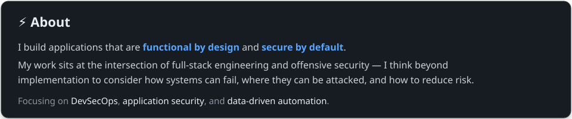
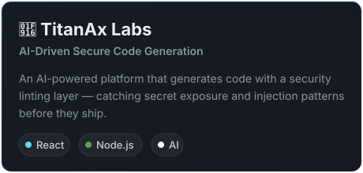
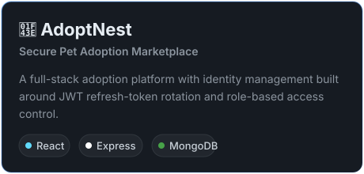
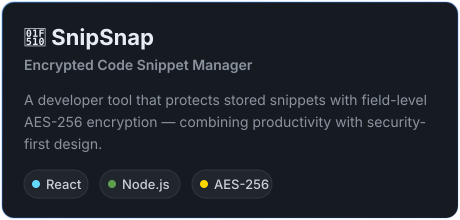
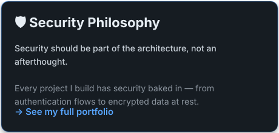
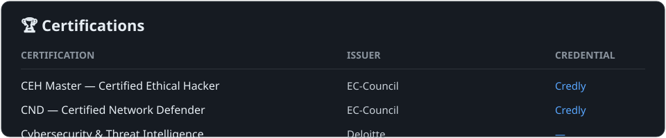
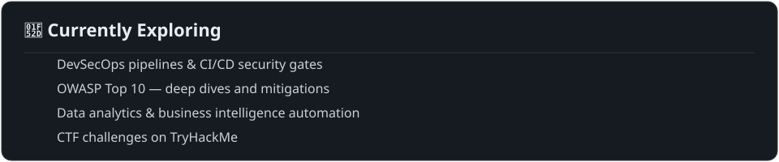

<!-- ═══════════════════════════════════════════════════════ -->
<!-- HERO -->
<!-- ═══════════════════════════════════════════════════════ -->

  

  

    

&nbsp;

&nbsp;

  

 

<!-- ═══════════════════════════════════════════════════════ -->
<!-- ABOUT -->
<!-- ═══════════════════════════════════════════════════════ -->

  

 

<!-- ═══════════════════════════════════════════════════════ -->
<!-- TECH STACK -->
<!-- ═══════════════════════════════════════════════════════ -->

## &nbsp;🛠&nbsp; Tech Stack

  

 

<!-- ═══════════════════════════════════════════════════════ -->
<!-- FEATURED PROJECTS -->
<!-- ═══════════════════════════════════════════════════════ -->

## &nbsp;🚀&nbsp; Featured Projects

  
  &nbsp;
  
    
  
  &nbsp;
  

 

<!-- ═══════════════════════════════════════════════════════ -->
<!-- GITHUB ACTIVITY -->
<!-- ═══════════════════════════════════════════════════════ -->

## &nbsp;📊&nbsp; GitHub Activity

  
    
  
    
  
  &nbsp;&nbsp;
  

<!-- ═══════════════════════════════════════════════════════ -->
<!-- CERTIFICATIONS -->
<!-- ═══════════════════════════════════════════════════════ -->

## &nbsp;🏆&nbsp; Certifications

  

 

<!-- ═══════════════════════════════════════════════════════ -->
<!-- CURRENTLY EXPLORING -->
<!-- ═══════════════════════════════════════════════════════ -->

## &nbsp;🔭&nbsp; Currently Exploring

  

 

<!-- ═══════════════════════════════════════════════════════ -->
<!-- FOOTER -->
<!-- ═══════════════════════════════════════════════════════ -->

 

**Building something that needs to be functional and resilient?**

  
  &nbsp;&nbsp;&nbsp;
  

  

<b>Full-Stack · Security · Data · Always shipping.</b>

