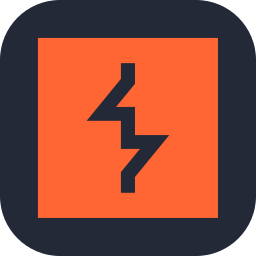
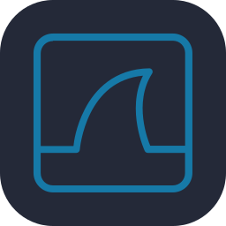
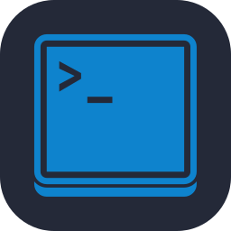
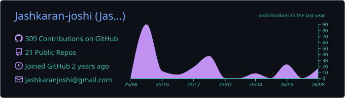
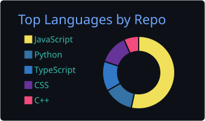
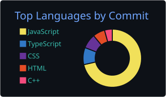

<!-- ═══════════════════════════════════════════════════════ -->
<!-- HERO -->
<!-- ═══════════════════════════════════════════════════════ -->

<div align="center">
  <div></div>
  <div></div>
  <br/><br/>

<a href="https://jaskaranjoshi.online">
  
</a>
&nbsp;
<a href="https://linkedin.com/in/jaskaran-joshi">
  
</a>
&nbsp;
<a href="https://tryhackme.com">
  
</a>

<br/><br/>


</div>

<br/>

<!-- ═══════════════════════════════════════════════════════ -->
<!-- ABOUT -->
<!-- ═══════════════════════════════════════════════════════ -->

<table width="100%">
  <tr>
    <td width="1000">

## &nbsp;⚡&nbsp; About

I build applications that are **functional by design** and **secure by default**.

My work sits at the intersection of full-stack engineering and offensive security — I think beyond implementation to consider how systems can fail, where they can be attacked, and how those risks can be reduced.

Currently deepening my focus on **DevSecOps**, **application security**, and **data-driven automation**.

```
Role   →  Full-Stack Developer · CEH Master · Security Enthusiast
Stack  →  MERN · Next.js · Django · Python
Focus  →  Secure, data-driven, production-grade applications
```

  </td>
  </tr>
</table>

<br/>

<!-- ═══════════════════════════════════════════════════════ -->
<!-- TECH STACK -->
<!-- ═══════════════════════════════════════════════════════ -->

## &nbsp;🛠&nbsp; Tech Stack

<table width="100%">
  <tr>
    <td align="center" width="250"><b>Frontend</b></td>
    <td align="center" width="250"><b>Backend & Languages</b></td>
    <td align="center" width="250"><b>Data & Infrastructure</b></td>
    <td align="center" width="250"><b>Security</b></td>
  </tr>
  <tr>
    <td align="center">
      &nbsp;&nbsp;
      &nbsp;&nbsp;
      
      <br/><br/>
      &nbsp;&nbsp;
      &nbsp;&nbsp;
      
    </td>
    <td align="center">
      &nbsp;&nbsp;
      &nbsp;&nbsp;
      
      <br/><br/>
      &nbsp;&nbsp;
      &nbsp;&nbsp;
      
    </td>
    <td align="center">
      &nbsp;&nbsp;
      &nbsp;&nbsp;
      
      <br/><br/>
      &nbsp;&nbsp;
      &nbsp;&nbsp;
      
    </td>
    <td align="center">
      &nbsp;&nbsp;
      &nbsp;&nbsp;
      
      <br/><br/>
      &nbsp;&nbsp;
      
    </td>
  </tr>
</table>

<br/>

<!-- ═══════════════════════════════════════════════════════ -->
<!-- FEATURED PROJECTS -->
<!-- ═══════════════════════════════════════════════════════ -->

## &nbsp;🚀&nbsp; Featured Projects

<table width="100%">
  <tr>
    <td width="500" valign="top">
      <h3>
        <a href="https://github.com/Jashkaran-joshi/TitanAx-Labs">🤖 TitanAx Labs</a>
      </h3>
      <p><b>AI-Driven Secure Code Generation</b></p>
      <p>An AI-powered platform that generates code with a security linting layer — catching <b>secret exposure</b> and <b>injection patterns</b> before they ship.</p>
      <p>
        
        
        
      </p>
    </td>
    <td width="500" valign="top">
      <h3>
        <a href="https://github.com/Jashkaran-joshi/AdoptNest">🐾 AdoptNest</a>
      </h3>
      <p><b>Secure Pet Adoption Marketplace</b></p>
      <p>A full-stack adoption platform with identity management built around <b>JWT refresh-token rotation</b> and <b>role-based access control</b>.</p>
      <p>
        
        
        
      </p>
    </td>
  </tr>
  <tr>
    <td width="500" valign="top">
      <h3>
        <a href="https://github.com/Jashkaran-joshi/SnipSnap">🔐 SnipSnap</a>
      </h3>
      <p><b>Encrypted Code Snippet Manager</b></p>
      <p>A developer tool that protects stored snippets with <b>field-level AES-256 encryption</b> — combining productivity with security-first design.</p>
      <p>
        
        
        
      </p>
    </td>
    <td width="500" valign="top">
      <h3>🛡️ Security Philosophy</h3>
      <br/>
      <blockquote>
        <b>Security should be part of the architecture, not an afterthought.</b>
      </blockquote>
      <p>Every project I build has security baked in — from authentication flows to encrypted data at rest.</p>
      <p>→ <a href="https://jaskaranjoshi.online"><b>See my full portfolio</b></a></p>
    </td>
  </tr>
</table>

<br/>

<!-- ═══════════════════════════════════════════════════════ -->
<!-- GITHUB ACTIVITY -->
<!-- ═══════════════════════════════════════════════════════ -->

## &nbsp;📊&nbsp; GitHub Activity

<div align="center">
  
  <br/><br/>
  
  <br/><br/>
  
  &nbsp;&nbsp;
  
</div>

<!-- ═══════════════════════════════════════════════════════ -->
<!-- CERTIFICATIONS -->
<!-- ═══════════════════════════════════════════════════════ -->

## &nbsp;🏆&nbsp; Certifications

<table width="100%">
  <tr>
    <th align="left" width="500">Certification</th>
    <th align="left" width="300">Issuer</th>
    <th align="left" width="200">Credential</th>
  </tr>
  <tr>
    <td><b>CEH Master</b> — Certified Ethical Hacker</td>
    <td>EC-Council</td>
    <td><code>ECC4870126593</code></td>
  </tr>
  <tr>
    <td><b>CEH Practical</b> — Certified Ethical Hacker</td>
    <td>EC-Council</td>
    <td><code>ECC7895124630</code></td>
  </tr>
  <tr>
    <td><b>CND</b> — Certified Network Defender</td>
    <td>EC-Council</td>
    <td><code>ECC7309568214</code></td>
  </tr>
  <tr>
    <td>Career Essentials in Cybersecurity</td>
    <td>Microsoft</td>
    <td><code>bd494211...</code></td>
  </tr>
  <tr>
    <td>Cybersecurity Job Simulation</td>
    <td>Mastercard</td>
    <td>—</td>
  </tr>
  <tr>
    <td>Cybersecurity Job Simulation</td>
    <td>JPMorgan Chase</td>
    <td>—</td>
  </tr>
  <tr>
    <td>Technology Job Simulation</td>
    <td>Deloitte</td>
    <td>—</td>
  </tr>
</table>

<br/>

<!-- ═══════════════════════════════════════════════════════ -->
<!-- CURRENTLY EXPLORING -->
<!-- ═══════════════════════════════════════════════════════ -->

## &nbsp;🔭&nbsp; Currently Exploring

<table width="100%">
  <tr>
    <td width="50">🔧</td>
    <td width="950">DevSecOps pipelines & CI/CD security gates</td>
  </tr>
  <tr>
    <td>🛡️</td>
    <td>OWASP Top 10 — deep dives and mitigations</td>
  </tr>
  <tr>
    <td>📊</td>
    <td>Data analytics & business intelligence automation</td>
  </tr>
  <tr>
    <td>🚩</td>
    <td>CTF challenges on TryHackMe</td>
  </tr>
</table>

<br/>

<!-- ═══════════════════════════════════════════════════════ -->
<!-- FOOTER -->
<!-- ═══════════════════════════════════════════════════════ -->

<div align="center">


<br/>

**Building something that needs to be functional and resilient?**

<p align="center">
  <a href="https://linkedin.com/in/Jashkaran-joshi" target="_blank">
    
  </a>
  &nbsp;&nbsp;&nbsp;
  <a href="https://Jashkaran-joshi.github.io/" target="_blank">
    
  </a>
</p>
<br/><br/>

<sub><b>Full-Stack · Security · Data · Always shipping.</b></sub>

</div>
